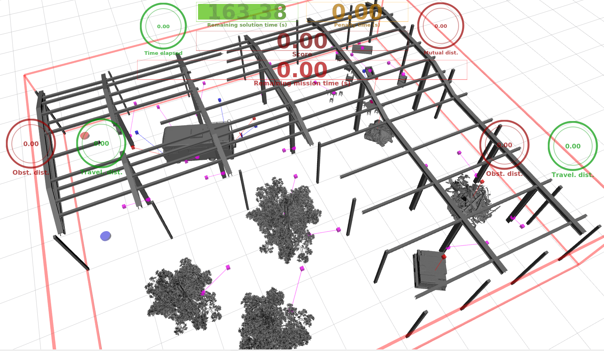

# Nutirobootika kaugtöölaud ja kaughallatavad katsestendid

Juhendi raames tuleb Constructi kaugtöölauale projekt ülesseadsitada.
Constructi keskkonnas saab ligi ka läbi õppegruppi litsentsi eelpool seadistatud katsestendi robotite ROS arvutite, milles saate koodikäitamist  päris riistvaral teostada.


Visuaalseks ja väljakutsuvaks näidiseks on alljärgnev ülesanne:
Koodi aknas olevat kopeerida https://www.theconstruct.ai/ keskonda oma kasutaja rosjecti. Seadsitada rosject üles Ubuntu koos Noetic ROS väljalaskega.

Ülesande eesmärk on keskenduda kahe mehitamata õhusõiduki (UAV, Unmanned Aerial Vehicles) koostööle kolmemõõtmelises keskkonnas, kus esineb takistusi.
Ülesanne seisneb UAV-de kokkupõrkevabade trajektooride planeerimises, et nende pardal olevad kaamerad inspekteeriksid N unikaalset kontrollpunkti.

Mõlemal UAV-l on etteantud algpositsioon ning piirangud maksimaalsele kiirusele ja kiirendusele.
Ülesande eesmärk on minimeerida inspekteerimiseks kuluvat aega, tagades samal ajal kõigi kontrollpunktide katmise ning vältides UAV-de kokkupõrkeid nii keskkonna kui ka üksteisega.

Ülesandega on kaasas juba töötav lahendus. Siiski on selle lahenduse jõudlus madal ning seda saab oluliselt täiendada.

## Paigaldus

Kasutakse [MRS UAV System](https://github.com/ctu-mrs/mrs_uav_system)süsteemi, mis on paigutatud [Apptainer](https://apptainer.org/) (varem tuntud kui Singularity) sisse.
Loodud skriptide kogum, mis lisab abstraktsioonikihi Apptainer süsteemi kohale. Näide shell-skripti kivitamisest:

```bash
./script.sh
```
Selle lähenemisviisi eesmärk on lihtsustada süsteemi kasutamist, et osalejad saaksid keskenduda rohkem ülesande lahendamisele ja vähem tehnilistele seadistustele.

Ühilduvus:

Linuxi operatsioonisüsteem,
Windows 11 + WSL 2.0 koos Linuxi operatsioonisüsteemiga,
Windows, millel on virtuaalne Linuxi operatsioonisüsteem,
Mac OS X koos virtuaalse Linuxi operatsioonisüsteemiga

Nõuded:

* [Apptainer](https://apptainer.org/)  Linux OS,
* umbes 6 GB vaba ketta ruumi.

### Paigalus protseduur

1.Apptaineri paigaldus
```
sudo apt update
sudo apt install -y software-properties-common
sudo add-apt-repository -y ppa:apptainer/ppa
sudo apt update
sudo apt install -y apptainer
apptainer --version
```

2. Clone kood, e.g., `~/git`:
```bash
mkdir -p ${HOME}/git
cd ${HOME}/git && git clone <your new repository's link>
```
Näide algupärase githubi kaustaga
```bash
mkdir -p ${HOME}/git
cd ${HOME}/git && git clone https://github.com/ivirro/Nutirobootika-kaugt-laud-ja-kaughallatavad-katsestendid-.git
```

3. Run the installation script that will install dependencies, download the MRS Apptainer image containing [MRS UAV System](https://github.com/ctu-mrs/mrs_uav_system), and compile the workspace:
```bash
chmod +x ${HOME}/git/Nutirobootika-kaugt-laud-ja-kaughallatavad-katsestendid-/install.sh
cd simulation/
chmod +x 01_install.sh 02_download.sh 03_compile.sh
cd ..
cd ${HOME}/git/Nutirobootika-kaugt-laud-ja-kaughallatavad-katsestendid- && ./install.sh
```

## Eesmärk

Kaks UAV-d (punane ja sinine ), mis kontrollivad kontrollpunkte (IP-d) võimalikult kiiresti 3D keskkonnas, kus on takistusi. Kaks UAV-d on varustatud MRS tarkvarakogumikuga [MRS control pipeline](https://github.com/ctu-mrs/uav_core), mis võimaldab täpset trajektoori jälgimist. Sinu ülesandeks on määrata IP-d UAV-dele ning luua mitme eesmärgiga rajad, mis külastavad iga IP vaatluspunktide (VP-d) positsioone, kus vastavad IP-d on uuritud pardakaamerate abil, hoides samal ajal takistustest ja UAV-de vahel ohutut kaugust. Lisaks tuleb konverteerida rajad kokkupõrkekindlateks, ajaga parameetritud trajektoorideks, mis arvestavad UAV-de dünaamiliste piirangutega. IP-d on määratud oma positsiooni ja kontrollnurgaga ning need jagunevad kolmeks alagrupiks:


1.  punased kohad: kontrollitavad ainult 🟥 UAV poolt,
2.  sinised kohad: kontrollitavad ainult 🟦 UAV poolt,
3.  lillad kohad: kontrollitavad mõlema (🟥 or 🟦)  UAVs poolt.



IP inspekteerimiseks tuleb külastada selle seotud VP-d õige UAV-ga, olles 0,3 m raadiuses ja järgides maksimaalset kõrvalekallet inspekteerimise suunas ja kallutuses 0,2 rad.
**Iga edukalt inspekteeritud punkt tõstab teie skoori 1 võrra..**

Optimeerimiseks on suurim skoori, vähima mõlema UAV lennuajaga.

Trajektuuri algus- ja lõpp-punktid peavad olema eelnevalt määratud. Missioon algab siis, kui trajektoori järgimine algab, ja lõpeb, kui UAV-d peatuvad oma alguspunktides. Piltide jäägiefekti ignoreeritakse; seetõttu ei pea UAV-d peatuma kindlatel VP-del.

## Lähteülesanne

Teil on käsutuses madala jõudlusega lahendus. See lahendus sisaldab järgmist:

UAV-de juhtimatu suund,
ühiste IP-de juhuslik jaotamine iga UAV vahel,
TSP (Traveling Salesman Problem) marsuudide arvutamine kasutades Eukleidilisi kauguse hinnanguid,
radade planeerimine halvasti parametriseeritud RRT planeerija abil,
trajektooride genereerimine, kus iga sirge lõigu lõpus on vajalik nullkiirus,
UAV-devaheline kokkupõrke vältimine on keelatud.
Selle lähenemisviisi poolt toodetud lahendusel on väga halb jõudlus ja see ei kogugi ühtegi punkti, kuid pakub suurt ruumi täiustamiseks.
Lahenduse täiustamiseks võite järgida allpool toodud samme või leida oma tee lahenduse parendamiseks.
Palun uurige koodi ja selle sisemisi kommentaare, et saada parem ülevaade erinevatest nõuannetest.

  **Parendus ettepanekud:**


1. Interpoleeri suund näidiste vahel. See on esimene asi, mida lahendada, kui soovite olla tõhus!
2. Katsetage erinevaid meetodeid, mis on saadaval VPi vahemaa hindamiseks ja kokkupõrkevaba radade planeerimiseks VPid ühendavate radade jaoks [saadaval planeerijad: A*, RRT (vaikimisi), RRT*].
3. Parandage kontrollitud punktide jaotamist kahe UAV vahel (vaikimisi juhuslik).
4. Katsetage erinevaid tee planeerijate parameetreid (nt võrgumudeli lahutusvõime või proovivõtukiirus) ja hinnake nende mõju lahenduse kvaliteedile.
5. Suurendage valitud tee planeerija jõudlust (nt tee sirgestamise või teavitatud RRT rakendamise kaudu).
6. Kaaluge lennuaega tee pikkuse asemel, kui otsite optimaalset asukohtade järjekorda TSP-s.
7. Rakendage tee silumist ja pidevat trajektoori proovivõtmist (ilma peatusteta vahepunktides), et kiirendada lendu. Koodis oleme valmistanud `toppra` teegi tee parametriseerimise arvutamiseks. Vaadake [dokumentatsiooni](https://hungpham2511.github.io/toppra/) ja proovige seda kasutada.
8. Töötle aja-parametriseeritud trajektoore, et lahendada UAV-devahelisi kokkupõrkeid. Alustage kokkupõrke vältimise rakendamisest, näiteks viivitage trajektoori algusega, kuni kokkupõrkeid ei esine. Näpunäide: proovige meetodeid, mis on saadaval konfiguratsioonifailis (vt allpool).
9. Jaotage IP-d tõhusalt ümber, et vältida kokkupõrkeid ja saavutada madalam kontrollimise aeg.
 
  **Vältida:**

* Väga suur minimaalne kaugus takistustest võib põhjustada tee planeerijate ebaõnnestumise leida tee mõningatesse asukohtadesse.
* Tee silumine ja lühemaks muutmine inspekteerimiskohtades võib viia inspekteerimispunkti mittetäitmiseni.
* Väikese lahutusvõimega võrgus proovivõtmine võib põhjustada vigu, mis on seotud diskretiseerimisega.

### Piirangud

| Constraint                                          | Virtual challenge | Real-world challenge |
| :---                                                | :---:             | :---:                |
| Maximum solution time (soft) - $T_s$                | 80 s              | 80 s                 |
| Maximum solution time (hard)                        | 200 s             | 150 s                 |
| Maximum mission time                                | 200 s             | 240 s                |
| Maximum velocity per x and y axes                   | 5 m/s             | 3 m/s                |
| Maximum velocity in z axis                          | 2 m/s             | 1 m/s                |
| Maximum acceleration per x and y axes               | 5 m/s^2           | 3 m/s^2              |
| Maximum acceleration in z axis                      | 2 m/s^2           | 1 m/s^2              |
| Maximum heading rate                                | 1 rad/s           | 1 rad/s              |
| Maximum heading acceleration                        | 2 rad/s^2         | 2 rad/s^2            |
| Minimum obstacle distance                           | 1.5 m             | 2.0 m                |
| Minimum mutual distance                             | 2.5 m             | 4.0 m                |
| Dist. from starting position to stop the mission:\* | 1.0 m             | 1.0 m                |

\* Trajektoori viimane punkt peaks vastama alguspunktile kuni 1 m täpsusega.

## Koodi saab muuta
Koodi saab muuta mugavaks jagamsiseks kaustas mrim_planner 

* `scripts/`
  * `planner.py`: Ristmiku skript, kus algab tee teie lahendusele. Siit leiate esialgsed ideed ja näited, kuidas laadida parameetreid.
  * `trajectory.py`: Sisaldab funktsionaalsusi trajektooridega põhjalikuks tööks. Siin saate interpoleerida suunda tee vahepunktide vahel ning katsetada radade sujuvamist, trajektooride valimist, punktide/tee/trajektooride kokkupõrgete arvutamist või trajektooride töötlemist kokkupõrgete vältimiseks.
  * `solvers/`
    * `tsp_solvers.py`: Siin toimub VPs määramine TSP-le, tee planeerimine ja TSP lahendamine. Siin saate katsetada VPs tõhusat määramist UAV-dele või uurida tee planeerijate mõju TSP lahenduse sooritusele.
    * `utils.py`:  Erinevate utiliitfunktsioonide vaikimisi allikas. Lisage julgelt oma funktsioonid.
  * `path_planners/grid_based`
    * `astar.py`: A* tee planeerija rakendamine. Siin saate lõpule viia planeerija õige heuristika funktsiooni abil ja lisada sirgjooneliseliikumise funktsionaalsuse.
  * `path_planners/sampling_based`
    * `rrt.py`: RRT tee planeerija rakendamine. Siin saate täiendada planeerijat RRT*-ks, rakendada paremat proovivõtumeetodit ja lisada tee sirgestamise funktsionaalsuse.
  * `config/`
    * `virtual.yaml` ja `real_world.yaml`: Konfiguratsioonifailid, mis sisaldavad erinevaid parameetreid/lüliteid ülesande jaoks. Kui vajate muid parameetreid, lisage need siia, laadige need scripts/planner.py faili ja kasutage neid vastavalt koodis.

Failides otsige märksõnu **`STUDENTS TODO`**, mis on paigutatud kohtadesse, kus eeldatavasti peate kirjutama või kasutama mõningaid koode. 
Vaikimisi ei tohiks teil olla vaja teha muudatusi kui ülaltoodud failides.

## Programmi jooksutamine

`simulation/` kaustas on saadaval hulk skripte, mis võimaldavad teil alustada ja peatada simulatsiooni ning hinnata oma koodi. **Paksus kirjas** skripte eeldatakse, et kasutaja kasutab neid otse.

Siin on tabel, kus on kirjeldatud erinevaid skripte:

| Skript                  | Kirjeldus                                                                         |
| :---                    | :---:                                                                               |
| **pycharm.sh**           | Käivitab PyCharm'i Apptaineris                                                      |
| **run_offline.sh**       | Käivitab teie lahenduse kergelt _taasesitusega_                                     |
| **run_simulation.sh**    | Käivitab teie lahenduse reaalajas dünaamilises simulatsioonis                       |
| **kill_simulation.sh**   | Peatab jooksva simulatsioonikeskkonna                                               |
| 01_install.sh            | Paigaldab Apptaineri tarkvara (kutsutakse üles `install.sh` kaudu)                 |
| 02_download.sh           | Laeb alla Apptaineri pildi (kutsutakse üles `install.sh` kaudu)                   |
| 03_compile.sh            | Kompileerib kasutaja tarkvara (kutsutakse üles `install.sh` kaudu)                 |
| apptainer.sh             | Sisenemispunkt Apptaineri shell'i (käivitage ainult siis, kui plaanite programmeerida `vim`-is) |

Need skriptid aitavad teil simulatsiooni alustada, peatada ja oma koodi hinnata.

**1) Offline: kerge arvutusvõimsusega simulatioon** ++++++

Alustuseks ilma dünaamilise simulatioonita.
Järgmine skript käivitab ülesande lahenduse, samal ajal kuvades probleemi ja trajektoore.
```bash
./simulation/run_offline.sh
```

Pärast `run_offline.sh` skripti käivitamist peaks teil olema võimalik näha sarnast visualiseerimist, kui trajektooride genereerimise protsess on lõppenud. RViz (ROS visualiseerimine) kuvab **näidislahenduse** ülesande jaoks.


RViz aknas on järgmised elemendid:

* Start/pausi nupp vasakus alumises nurgas. **(Kasutage nuppu "Send Topic" ja mitte RViz "Pause" nuppu)**
* Üldine trajektooride info ülemises vasakus/paremas nurgas (taust on roheline, kui kõik kontrollid on OK, punane, kui midagi on valesti).
* Praegune lennu statistika otse allpool.
* Informatsioon ülesande ja tulemuse kohta, mis on keskendatud ülaosas.
* Jooned, mis lõikuvad mõlema tee vahel ja näitavad kokkupõrkeid.
  
**2) Online: käivita simulatsioon kohapeal**

Allpool olev skript käivitab teie lahenduse ülesandele koos *MRS Multirotor Simulator* ja [MRS UAV süsteemiga](https://github.com/ctu-mrs/mrs_uav_system), simuleerides kahte UAV-d.
```bash
./simulation/run_simulation.sh
```
Simulatsiooni peatamiseks kutsuge välja:
```bash
./simulation/kill_simulation.sh
```
***Asjad, mida tuleb konfigureerida/muuta:**

* **Probleemi tüüp:** Vaikimisi käivitab `run_simulation.sh` skript 2 UAV-d `warehouse` maailmas ja käivitab *warehouse_small* probleemi.  
Kui soovite muuta probleemitüübi `warehouse_large` või `warehouse_yard`-iks, peate tegema järgmised muudatused:

  * Muutke parameetrit `problem/name` failis `mrim_task/mrim_planner/config/virtual.yaml` väärtuseks `warehouse_large.problem` või `warehouse_yard.problem` (vaadake sektsiooni [Testing](https://github.com/ctu-mrs/summer-school-2024#testing))

Võite märgata, et teie terminalis on avatud mitu vahekaarti.  

Olulised vahelehed simulaatoriga suhtlemiseks on loetletud allpool:

| Vaheleht          | Kirjeldus                                                                    |
| :---             | :---:                                                                          |
| **planner**        | Näitab teie planeerija väljundit, kus saate jälgida tee planeerimise protsessi ja tulemusi. |
| **state_machine**  | Küsib planeerijalt trajektoore ja haldab katse täitmist. See on koht, kus hallatakse missiooni loogikat. |
| **start_planning** | Valmistab ette käsu uuesti planeerimise alustamiseks. |
| **control**        | Kuvab MRS UAV süsteemi juhtimisliini, kus täidetakse UAV-dele antud käske. |


## Probleemi ülesanded - Testimine

Teil on ette valmistatud kaks probleemi teie lahenduse testimiseks ja hindamiseks. Probleemid asuvad kaustas `mrim_resources/problems`: saate nende vahel vahetada, muutes faili `mrim_planner/config/virtual.yaml` reas `problem/name` järgmiste väärtuste vahel:

  1. `warehouse_small.problem` on lihtne probleem, millel on vähem IP-sid. Sobib klastrite tegemiseks, TSP järjestuste täiendamiseks, lahenduse parameetrite määramiseks ja testimiseks.
  2. `warehouse_large.problem` on keeruline probleem, kus on 31 IP-d, mis testib teie lahendust täielikult.
  3. `warehouse_yard.problem` on keeruline probleem, kus on 32 IP-d, mis testib teie lahendust täielikult. Sobib parameetrite lõppviimistluseks 


## Silumine

**võite kohata**
```
open terminal failed: missing or unsuitable terminal: rxvt-unicode-256color
```

*lahendus*: käivita skript  `./kill_simulation.sh` 

```
